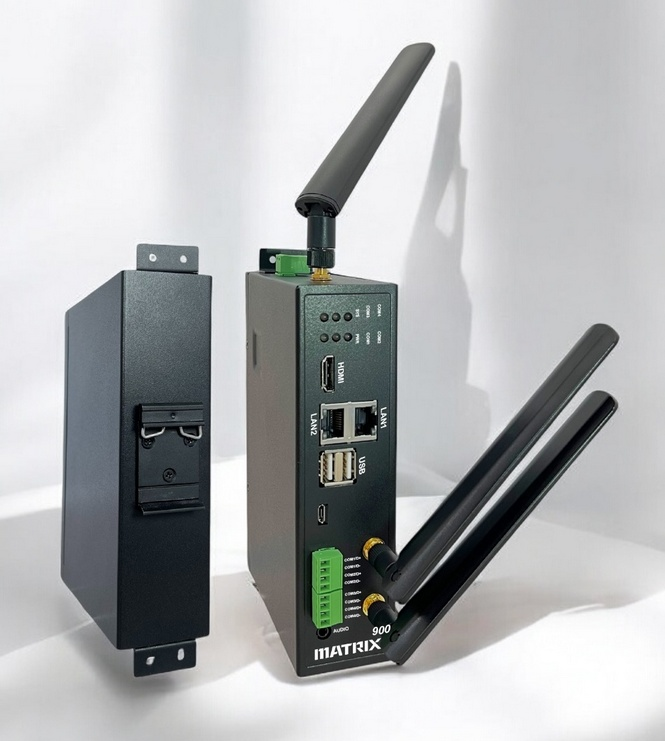

# Matrix-900
Quad-core Cortex-A72 powered IIoT Gateway supports M.2 AI inference accelerator

## Introduction
the Matrix-900, a cutting-edge embedded computing platform designed for advanced Industrial Internet of Things (IIoT) applications. Leveraging the powerful **Raspberry Pi Compute Module 4**, the Matrix-900 is engineered to meet the demands of modern industrial environments with superior performance, flexibility, and reliability.

## H/W Specifications

### SoM (Raspberry Pi Compute Module 4)
- Processor: BCM2711, quad core Cortex-A72 (ARM v8) 64-bit SoC @ 1.5GHz
- DDR: 1/2/4/8GB
- eMMC: 8/16/32GB
- By design, the Matrix-900 does not support booting from an SD card

### Dual Ethernet Interface
- 1 x Gigabit Ethernet
- 1 x 10/100Mbps Ethernet
- Connector: RJ45 (with LED indicator)

### Dual USB Host Interface
- 2 x USB 2.0 compliant hosts
- Supports 480Mbps high speed mode 
- Connector: Type A

### HDMI Display Port
- 1 x HDMI port
- HDMI 2.0 compliant, upto 4K@60fps
- Connector: Type A

### Stereo Audio Output
- Codec: TI TLV320
- Connector: 3.5mm audio jack (4-pole)
- Mated plug: 3.5mm TRRS connector
- Standard: CTIA(MGRL) or OMPT(GMRL)? 

### Four RS-485 Serial Ports
- 4 x RS-485 serial ports
- Connector: Terminal block
- Signal: Data+, Data-
- Auto direction control: yes
- Terminal resistor: 120&Omega;, enable/diable by jumper
- Baudrate: upto 12Mbps
- Data bits: 7, 8
- Stop bits: 1, 2
- Parity: Odd/Even/Mark/Space/None

### M.2 Expansion Socket
- Interface: PCIe (1-lane, Gen2)
- Key type: B Key
- Use case 1: AI inference accelerator
- Use case 2: 5G/GPS communication module
- Use case 3: SSD module
- Nano-SIM socket: yes, on-board (SIM-M)
- Module dimension: supports upto 30x52mm
- Fixing screws: at 42mm and 52mm position

### miniPCIe Expansion Socket
- Interface: USB 2.0
- Supports 480Mbps high speed mode
- Use case 1: 4G/GPS communication module
- Use case 2: WiFi/BLE module
- Nano-SIM socket: yes, on-board (SIM-E)
- Module dimension: supports full-size module
- Fixing screws: for full-size modules

### SD Card Socket
- 1 x microSD socket
- SD 3.0 compliant
- Storage capacity: SDXC
- By design, the Matrix-900 does not support booting from an SD card

### Real Time Clock
- Yes, on-board
- Backup: external battery
- Connector: 2-pin 1.25mm wafer box

### Console/Debug Port
- RS-232 serial port (inside the box)
- Signal: Tx/Rx/GND
- Connector: 4-pin wafer
- Communication parameters: 115,200bps, N81

### General
- Dimensions (W x H x D): 45 x 166 x 120mm
- Net weight: ??? g (lb)
- Typical power Consumption: 1A@12VDC
- Operation temperature: 0~70&deg;C (32-158&deg;F) 
- Installation: supports DIN-Rail mount and wall mount.
- Regulations: CE Class A and FCC Class A

## Order Information
- **Matrix-900 :** Standard integrated package, a CM4 (4G/16G, no-WiFi) with thermal pad is mounted on the IO board and the whole assembly is packaged into a sheet metal box. Mounting accessories are included, and the Raspberry Pi OS with desktop is also pre-installed in factory.
- **Matrix-900-IO-Board :** IO Board only,  necessary teminal blocks are included. Users need to prepare and install prefered CM4 and OS by themselves.
- **Matrix-900-Box :** The standard sheet metal box used for Matirx-900. Mounting accessories are included.

**Note :**  CM4 is the abbreviation of Raspberry Pi Comput Module 4

 **Fig. above: Matrix-900-IO-Board** Top side & Bottom side 